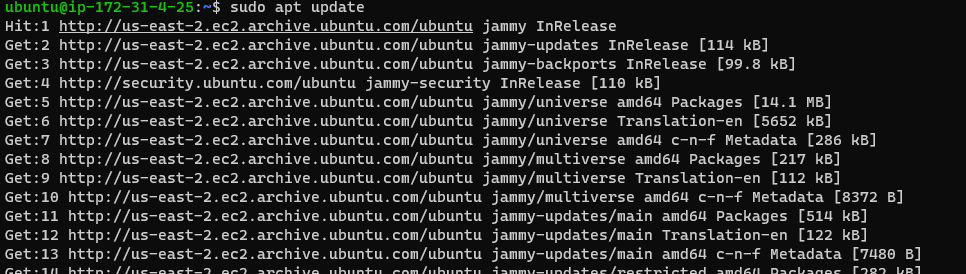
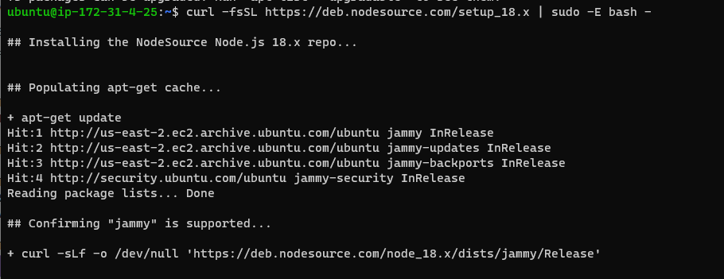
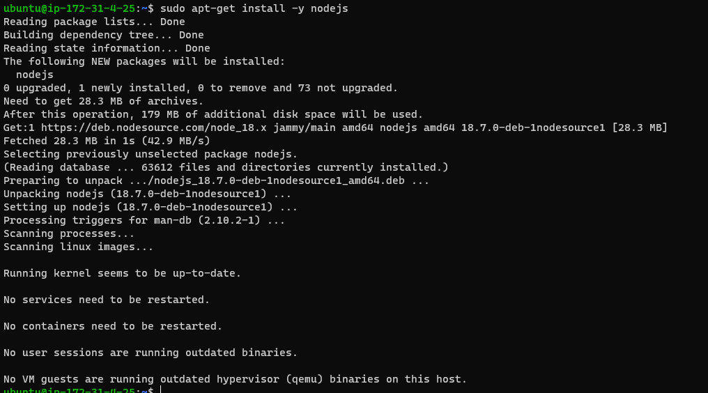
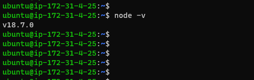
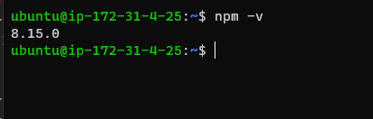
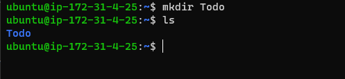
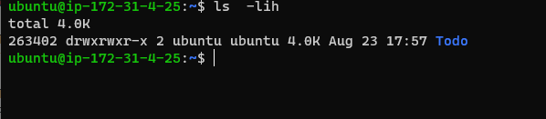
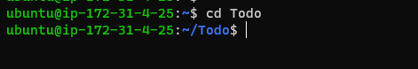
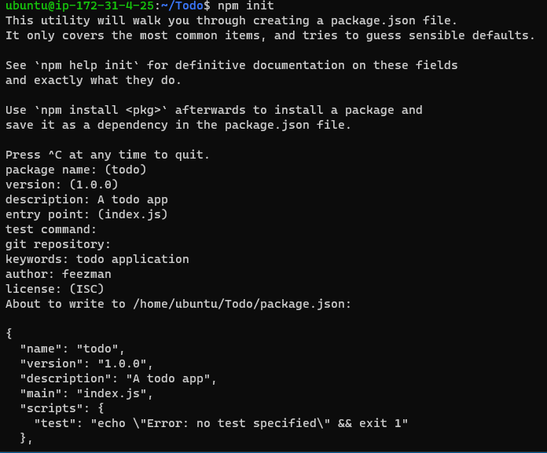
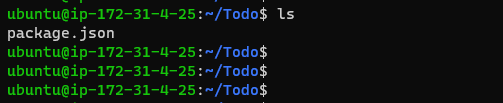

## Step1 

## BACKEND CONFIGURATION

`sudo apt update`

`curl -fsSL https://deb.nodesource.com/setup_18.x | sudo -E bash -`

`sudo apt-get install -y nodejs`

`node -v `

`npm -v `

`mkdir Todo`

`lih`

`cd todo`

`npm init`

`ls`

## Step2

## INSTALL EXPRESSJS

