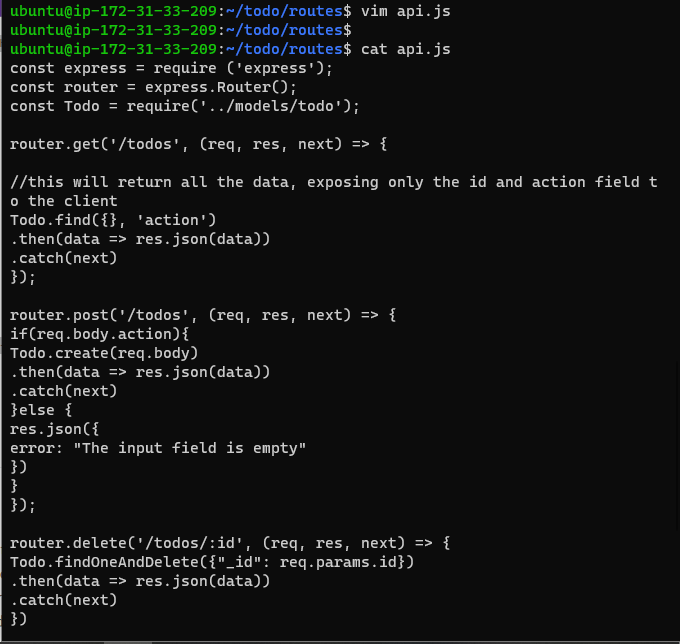

## Step1 

## BACKEND CONFIGURATION

`sudo apt update`

`curl -fsSL https://deb.nodesource.com/setup_18.x | sudo -E bash -`

`sudo apt-get install -y nodejs`

`node -v `

`npm -v `

`mkdir Todo`

`lih`

`cd todo`

`npm init`

`ls`

## Step2

## INSTALL EXPRESSJS

`npm install express`

`touch index.js`

`npm install dotenv`

`vim index.js`

`node index.js`

`curl -s http://169.254.169.254/latest/meta-data/public-ipv4 `

`http://19.119.14.227:5000`

`mkdir routes`

`cd routes`

`touch api.js`

`vim api.js`

`npm install mongoose`

`mkdir models`

`cd models`

`touch todo.js`

`vim todo.js`

`vim api.js`

